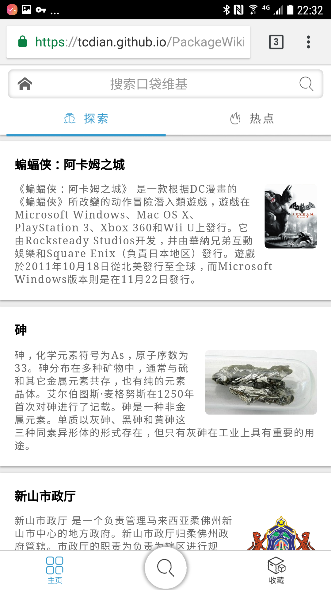
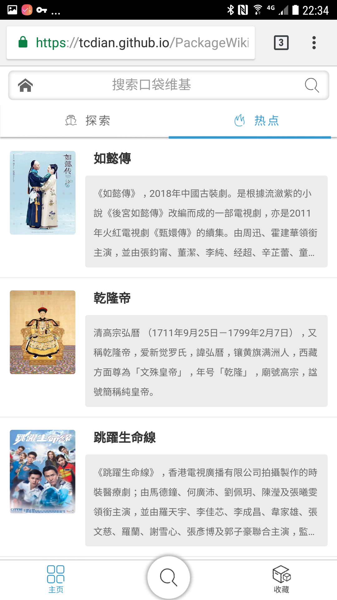
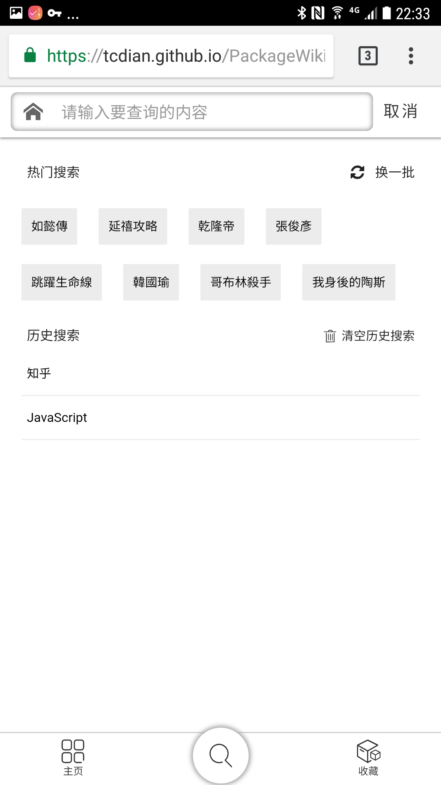
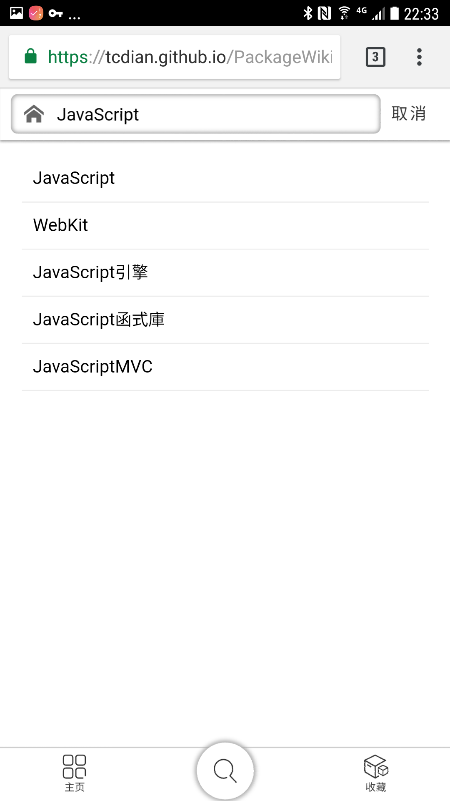
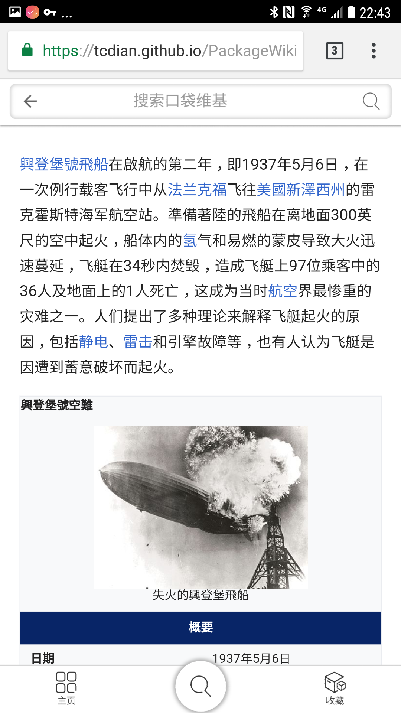
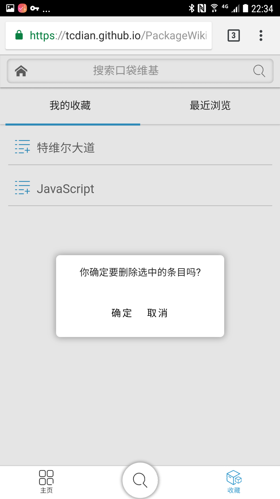

# PackageWiki

### [在线 Demo](https://tcdian.github.io/PackageWiki/)

##### 客户端需要可以直接访问 Wikipedia 服务器

### 说明
一个简易的维基百科小项目, 项目使用的是维基百科的数据, 客户端需要可以直接访问 Wikipedia 服务器才可以使用, 项目支持查看, 搜索, 收藏和删除, 历史记录和清空历史记录, 探索页面抓取的维基百科随机数据, 下拉可以加载新数据, 时间仓促, 会有一些 bug 存在, 劳烦大家指正, 多谢多谢~

因为没有自己配置服务器, 用的 github pages, vue-router 使用 hash 模式防止刷新页面发送服务器请求时报错.

### 功能
* 查看 Wikipedia 条目
* 搜索
* 收藏和长按删除
* 查看历史记录和清空历史记录
* 随机条目和每日热门推荐

### 截图

 

...

 

...

 

### 技术栈
* Vue
* Vuex
* Vue-router
